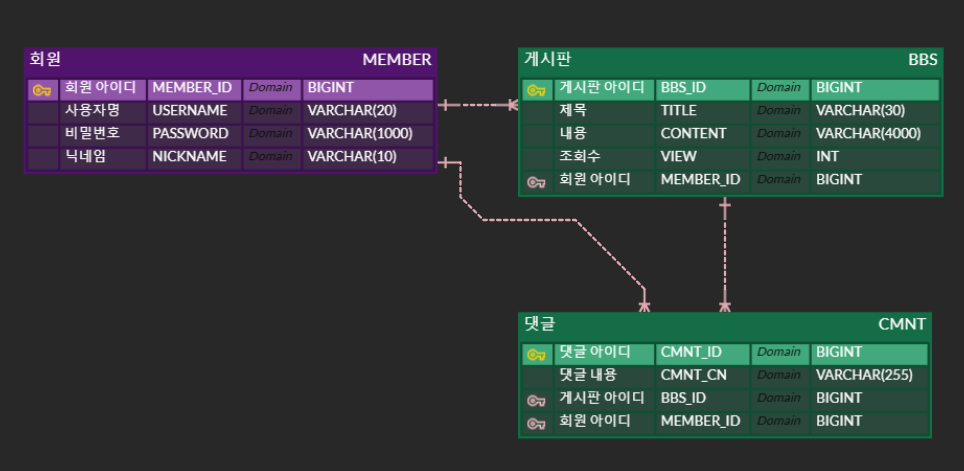
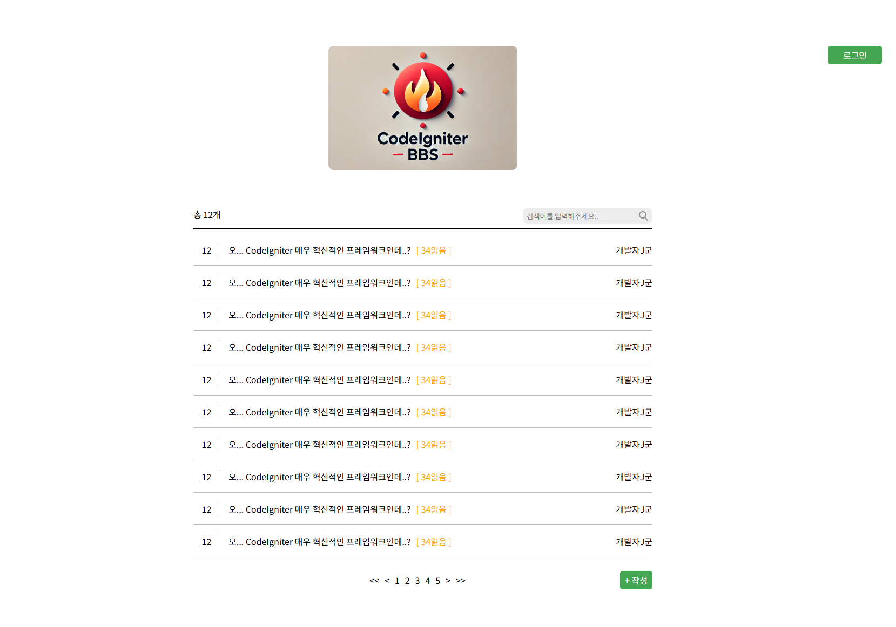
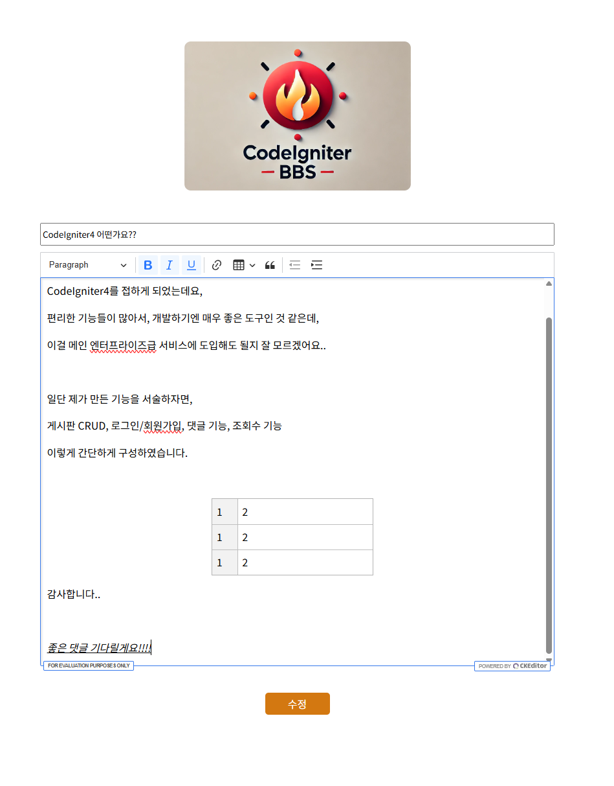
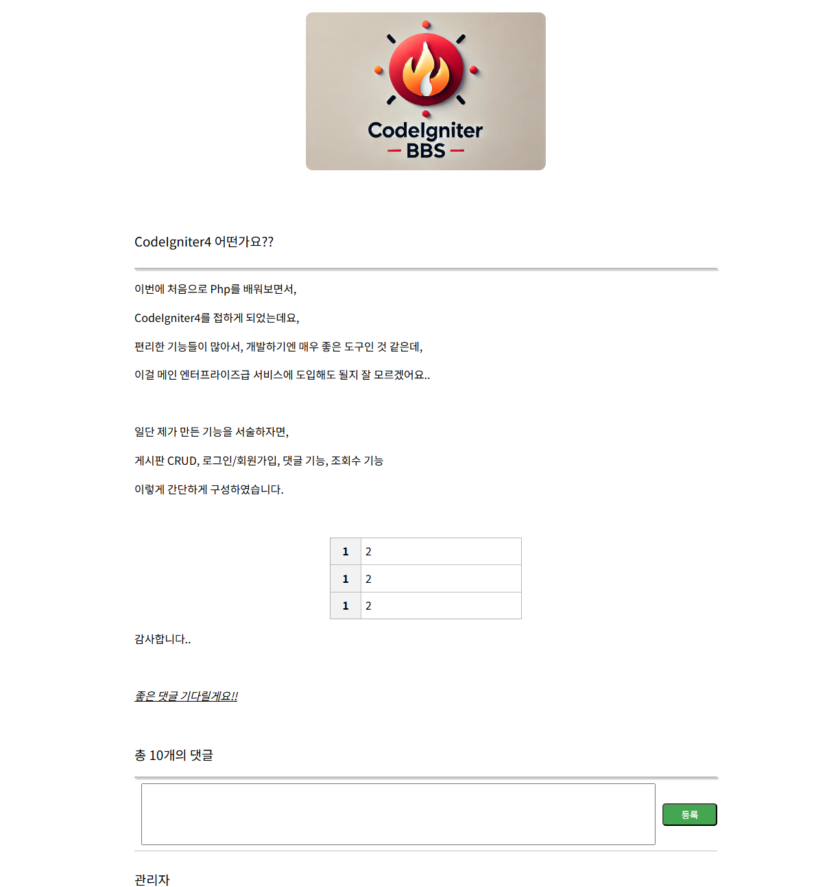
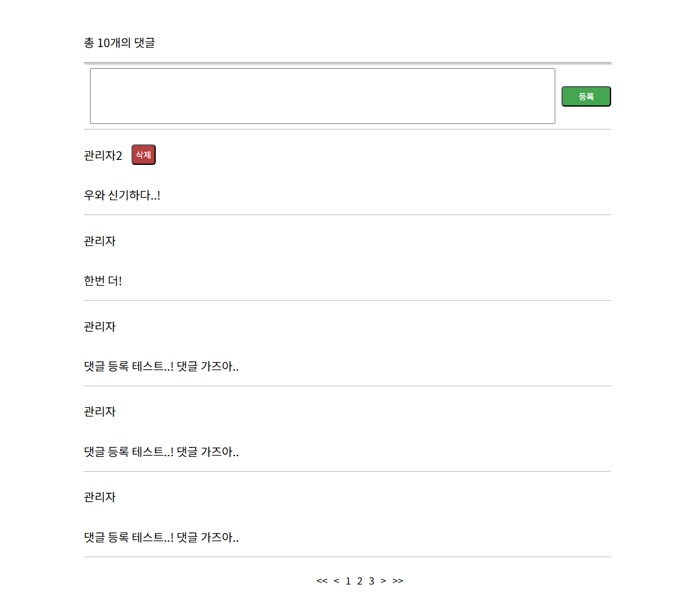

# CodeIgniter4

- CodeIgniter는 php언어로 웹개발을 쉽게 할 수 있도록, MVC패턴에 맞게 개발가능한 웹프레임워크이다.
- 쉬운 접근성으로 Learning Curve가 낮다는 장점이 있다.
- 개발환경을 구축하기 위해서는 4버전 기준으로 최소 PHP 7.4 버전이 필요하다.
- PHP만 설치되어있다면, 실행환경을 구축할 수 있다.

# 프로젝트 소개

- CodeIgnite의 기능을 익히고자, 간단한 게시판 CRUD프로젝트를 기획하였습니다.
- 로그인/회원가입 기능, 게시판 목록 페이징 조회, 게시판 등록/수정, 댓글에 대한 기능이 구현하였습니다.

# 기술스택
- php-8.1
- CodeIgniter 4.4.3
- MySQL

# MySQL DDL
```sql
CREATE TABLE `member` (
    `member_id` bigint NOT NULL AUTO_INCREMENT,
    `username` varchar(20) DEFAULT NULL,
    `password` varchar(1000) DEFAULT NULL,
    `nickname` varchar(10) DEFAULT NULL,
    PRIMARY KEY (`member_id`)
) ENGINE=InnoDB AUTO_INCREMENT=4 DEFAULT CHARSET=utf8mb4 COLLATE=utf8mb4_0900_ai_ci;

CREATE TABLE `bbs` (
    `bbs_id` bigint NOT NULL AUTO_INCREMENT,
    `title` varchar(30) DEFAULT NULL,
    `content` varchar(4000) DEFAULT NULL,
    `view` int DEFAULT NULL,
    `member_id` bigint NOT NULL,
    PRIMARY KEY (`bbs_id`),
    KEY `member_id_idx` (`member_id`)
) ENGINE=InnoDB AUTO_INCREMENT=280 DEFAULT CHARSET=utf8mb4 COLLATE=utf8mb4_0900_ai_ci;

CREATE TABLE `cmnt` (
    `cmnt_id` bigint NOT NULL AUTO_INCREMENT,
    `cmnt_cn` varchar(255) DEFAULT NULL,
    `bbs_id` bigint NOT NULL,
    `member_id` bigint NOT NULL,
    PRIMARY KEY (`cmnt_id`),
    KEY `cmnt_bbs_id_fk_idx` (`bbs_id`),
    KEY `cmnt_member_id_fk_idx` (`member_id`),
    CONSTRAINT `cmnt_bbs_id_fk` FOREIGN KEY (`bbs_id`) REFERENCES `bbs` (`bbs_id`),
    CONSTRAINT `cmnt_member_id_fk` FOREIGN KEY (`member_id`) REFERENCES `member` (`member_id`)
) ENGINE=InnoDB AUTO_INCREMENT=19 DEFAULT CHARSET=utf8mb4 COLLATE=utf8mb4_0900_ai_ci;

```

# 프로젝트 사진

## ERD


## 메인 페이지


## 게시글 에디터


## 게시글 뷰어


## 댓글
